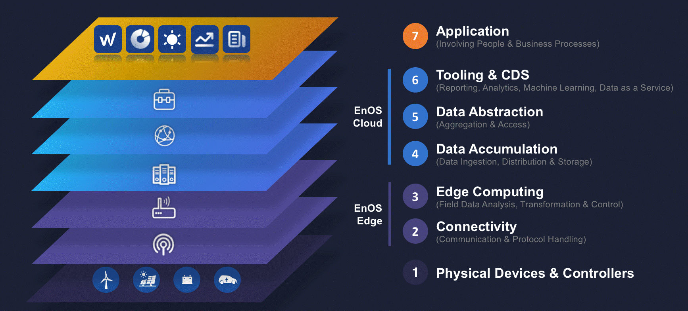
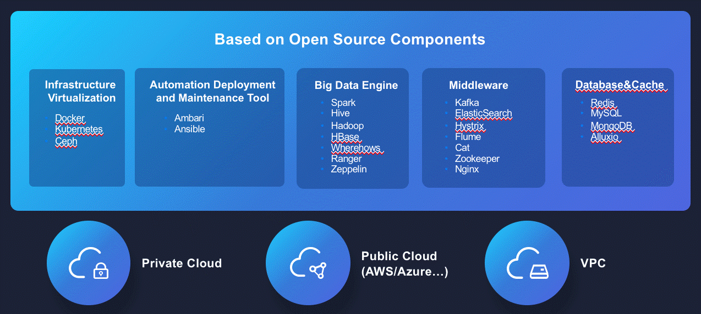
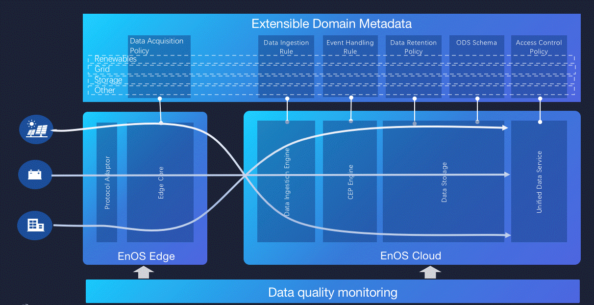

In an IoT system, data is generated by multiple devices, transmitting from
different channels, with different protocols and data types to be consumed by
different applications. The following Figure illustrates a simplified view of an
IoT architectural model that comprises seven levels.

Envision IoT solution offers capabilities across connectivity, tooling, and
common data service (CDS). In the EnOS, data can flow in both directions. In a
control pattern, the data flows from top (Level 7) to bottom (Level 1) of the
model. In a monitoring pattern, the data flows are reversed. The solution mainly
comprises the EnOS Edge stack and EnOS Cloud stack.

**EnOS Edge Stack**

*Layer 2. Connectivity Layer*

The data flow is concentrated at Level 2. The most important function of Level 2
is its ubiquitous connectivity which must be transmitted reliably and timely.
The EnOS Edge connectivity framework supports 148 drivers and covers most
industry standards and proprietary protocols from major energy equipment and
household appliance manufacturers.

*Layer 3. Edge Computer Layer*

The functions of Level 3 are driven by the need to convert network data flows
into information that is suitable for storage and upper-level processing. The
EnOS Edge computing engine can ingest, analyse and compute large scale
high-volume data in real time.

**EnOS Cloud Stack**

*Layer 4. Data Accumulation Layer*

Prior to Level 4, data was moving through the network at the rate determined by
the business demand. We call this data in motion. At the data accumulation
layer, data in motion is converted to data at rest. EnOS IoT Hub will segment
information based on domain expertise to determine:

-   Whether the data is to be stored or cleansed?

-   Whether the data should be written on disk in a non-volatile state or
    accumulated in memory for short-term use?

-   Whether the data is of interest to domain specific applications? If so, the
    data is configured to serve the specific scenario needs.

*Layer 5. Data Abstraction Layer*

With multiple data ingestion channels and 4Vs (volume, velocity, variable, and
veracity) of data characteristics, data may not land in the same data store. At
the data abstraction level, EnOS IoT Hub can process many different things,
including：

-   Reconciling multiple data formats from different sources.

-   Assuring consistent semantics of data across sources.

-   Ensuring that data is complete for upper-level processing.

-   Consolidating data into one place and providing access to multiple data
    stores through a unified API.

-   Protecting data with appropriate access control.

-   Indexing and optimizing data to provide faster accessibility to upper-layer
    tooling and applications

**Layer 6. Tooling & CDS Layer**

To help clients and partners build and integrate their own industry applications
and services, EnOS cloud offers best-of-breed development tools and common data
service such as weather, terrain, and energy trading to manage IOT end to end
with energy. With these tools, clients can deploy software applications within
hours and days instead of weeks and months. Modularizing monolithic software
solutions with these agile applications offers customers flexibility and
tailored functionality.

## EnOS Edge: Simplified Ubiquitous Connectivity for All

Connectivity is one of the main topics in IoT. To achieve end-to-end integration
of data, businesses must first take the fundamental step of connecting assets to
the digital world. The raw data produced by industrial plants, machines,
automation systems and devices cannot be comprehensively analysed without first
being linked, captured and managed.

EnOS Edge provides adaptor framework that allows new communication protocols to
easily plugin and support newly installed devices or systems without affecting
existing data ingestion. EnOS Edge also provides the EnOS Edge agent, which can
be embedded on smart devices, to provide out-of-the-box connectivity with EnOS
Cloud. The EnOS Cloud has EnOS Edge SDKs that enables developers to write custom
edge implementation to connect to it without any knowledge of internet
protocols.

With a vast device library accumulated from rich energy domain experiences, the
EnOS Edge can connect to any energy “thing”. There are over 3000 types of
devices that have been connected to EnOS production environment that consume,
orchestrate or measure electricity — including meters (water, gas and electric),
generators, fuel tanks, automatic transfer switches, chillers, boilers, HVAC
control panels, CHP, solar panels, EV chargers and any other intelligent
mechanical equipment.

By adopting open protocols and standards from devices, assets, and other
automation systems from vendors, EnOS is enabled to interoperate with multiple
systems and can create a homogeneous data sets that enables data analytics to
create intelligence in the ecosystem.

## EnOS Cloud and APIs: Flexible Deployment and Seamless Integration

Envision offers the EnOS IoT operating system with on-prem, private and public
cloud offerings to enable clients to develop, run and operate their applications
without the complexity of building their own infrastructures or managing complex
software stacks.

Together with our partner Microsoft Azure, the platform can easily scale to the
required data volumes and to the numbers of connected devices and users,
allowing on-demand and pay-per-use pricing that leads to compute
cost-efficiency. EnOS also can be deploy on virtual private cloud (VPC) and
private cloud without dependency on underlying hypervisors. Customers have a
choice on deploying the solution that best suits their requirements for cost,
control, configurability, scalability, location and security.

EnOS is built on an open source software stack that is enterprise grade to run
your mission-critical systems. EnOS can easily integrate with a growing list of
industry recognized, 3rd-party visualization, reporting, tracing, monitoring and
analytics tools for comprehensive solutions.

Transformation of IoT data into meaningful and actionable information for
companies is not “one size fits all.” EnOS delivers a wide variety of open
application programming interfaces (APIs), which enables developers to build
applications that suit a broad range of business requirements, with little
effort. It also facilitates the development of applications and considerably
reduces time to market and development costs.

## EnOS Data Model: Domain Driven Data Architecture

EnOS is specially designed as an operating system for the IoT platform unlike
other generic data platform service providers who only provide ETL and analytics
functions. EnOS is built with domain driven insights and a robust data
architecture that enables clients to easily connect, visualize, analyse and
optimize the automation process.

Through extensive domain metadata accumulated, EnOS supports standardized data
acquisition policies, ingestion rules, event handling rules, data retention
policies, ODS schema, access control policies and data quality policies. With
all those configurable metadata mapping from the data source to the data
consumed, this process will significantly reduce the effort required for data
cleansing and normalization.
