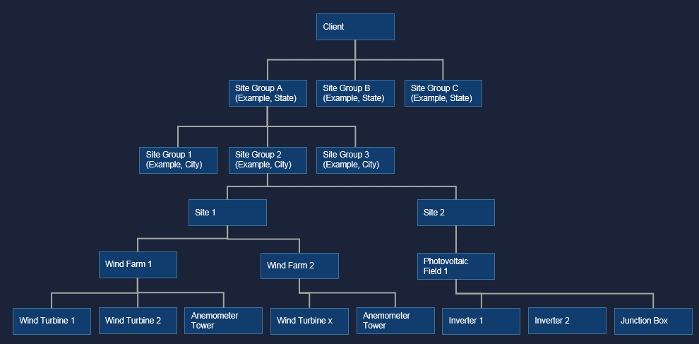

# Asset Management Overview

In the EnOS platform, an *asset* is a device or an organization entity where the
asset belongs to. In practice, devices are typically organized hierarchically.
The hierarchical structure is an *asset tree*, and each node in the tree is an
asset.

The EnOS platform allows you to create assets through instantiating device
models, build your asset tree in terms of business structure, and perform
subsequent data processing and application based on the hierarchy.

## Asset Hierarchy

The EnOS platform provides the following types of asset nodes to help you
organize your assets:

-   **Site**: indicates a physical site where your devices reside. Site is the
    default node in an asset tree. A site can have multiple subordinate
    *projects*.

-   **Site group**: a self-defined node in the asset tree that can have multiple
    subordinate sites. For example, a city or state where the sites reside. You
    can define multiple layers of site groups according to your needs.

-   **Client**: the root node of an asset tree. A customer can have multiple
    subordinate sites, multiple site groups, or multiple level of site groups.

-   **Project**: a logical organization entity, which indicates a subset of a
    site. The subset of the site can be of a certain *domain,* where a domain is
    the common attribute that describes the devices in a project or in a device
    group of a project. For example, when the domain is wind farm, the devices
    in the project or device group are wind mills.

-   **Device group**: a logical organization entity, which indicates a subset of
    a project, this node is optional in an asset.

-   **Device**: a device of a certain model that belongs to a certain domain.
    For example, a turbine device in the wind farm domain.

Among the types of asset node, projects and devices are created from model.

The following figure shows an example asset tree in EnOS.

